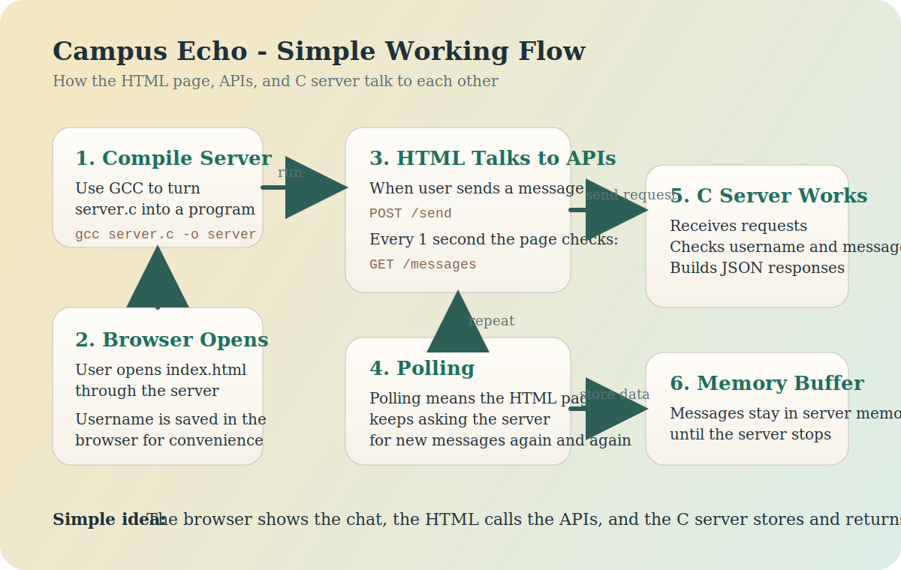

# Campus Echo - Simple Explanation



## What this project is

This is a simple chat application.

- `index.html` shows the chat screen in the browser
- `server.c` is the backend server written in C language
- the server keeps messages in memory while it is running

## First step: compile the server

Before the app can run, the C file has to be compiled.

Compiling means converting the C code into a real program that the computer can run.

### Using GCC on Linux or macOS

```bash
gcc server.c -o server
```

After this, a program named `server` is created.

### Using GCC or Clang on Windows

```bat
build_server.bat
```

After this, a program named `server.exe` is created.

## How the app starts

1. The user runs the compiled server.
2. The server starts listening on port `8080`.
3. The user opens the browser and visits `http://localhost:8080`.
4. The server sends back the `index.html` file.
5. The browser shows the Campus Echo chat screen.

## How the browser and server communicate

The browser and server talk using **HTTP requests**.

This means the HTML page asks the server for data, and the server sends data back.

### Example

- The browser asks: "Give me the chat page"
- The server replies with `index.html`

Later:

- The browser asks: "Here is a new message"
- The server saves it

Later again:

- The browser asks: "Give me the latest messages"
- The server returns them in JSON format

## How the HTML file works

The `index.html` file contains:

- the page design
- the chat input box
- the username modal
- JavaScript code

The JavaScript inside `index.html` does the real connection work.

It:

- sends messages to the server
- asks the server for new messages
- updates the chat screen
- plays a small sound when a new message arrives

## How polling works

The HTML page does not keep a permanent live socket connection.

Instead, it uses **polling**.

Polling means:

- the page keeps asking the server for updates again and again
- in this project, it asks every 1 second

So the flow is:

1. JavaScript waits for 1 second
2. it calls the server
3. it gets the latest messages
4. it shows them in the chat window
5. it repeats

This is simple and easy to understand.

## APIs used by the HTML page

### `GET /`

Used to load the web page.

The server returns the `index.html` file.

### `POST /send`

Used when the user sends a new chat message.

The browser sends:

- username
- message text

The server receives it and stores it in memory.

### `GET /messages`

Used by the HTML page to check for chat updates.

This is the main polling API.

The server returns a JSON list of messages.

### `GET /users`

Used to get the list of active users.

### `GET /stats`

Used to get server information such as:

- total stored messages
- per-user message limit

## How sending a message works

1. The user types a message in the browser.
2. JavaScript reads the username and message.
3. JavaScript sends `POST /send`.
4. The C server receives the request.
5. The server checks the data.
6. The server stores the message in its memory buffer.
7. The browser later fetches the updated list using `GET /messages`.

## How receiving messages works

1. The browser keeps polling `GET /messages`.
2. The server sends back the latest messages.
3. JavaScript reads the JSON response.
4. The chat UI is updated on screen.

If another user sends a message, it appears after the next poll.

## Where messages are stored

Messages are stored inside the **application server memory**.

That means:

- messages are not stored in a database
- messages are not permanently saved to disk
- messages stay only while the server is running

The server also keeps a message limit per user.

This means old messages are removed when the limit is crossed.

## Simple summary

The full flow is:

1. Compile `server.c` using `gcc`
2. Run the compiled server
3. Open the app in the browser
4. Browser loads `index.html`
5. JavaScript in the HTML file calls the APIs
6. The C server stores messages and returns them
7. The browser polls every second to keep the chat updated

In one line:

**HTML shows the app, JavaScript calls the APIs, and the C server handles all chat communication.**
